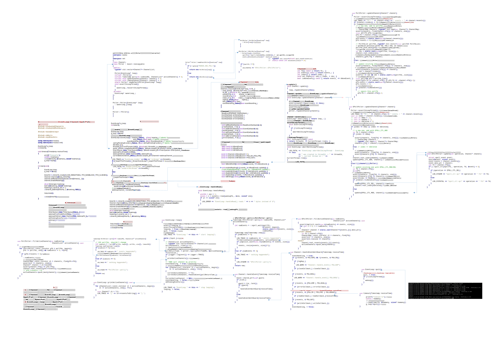
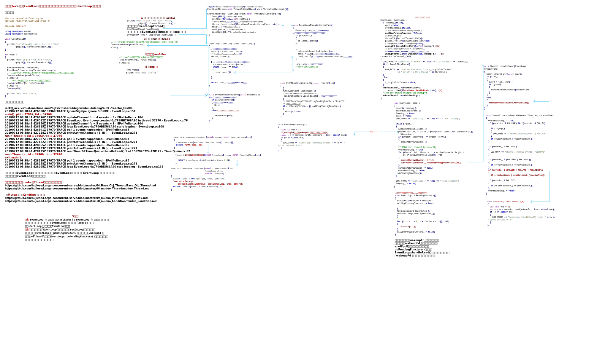

## 图解Muduo网络库

通过一些例子来分析muduo网络库的运作原理，需要使用viso画图软件打开。

这部分主打muduo的net部分代码，也是最为核心的部分，至于一些基础部分的base文件夹下的代码分析可见：

> https://github.com/hujiese/Large-concurrent-serve/

这部分分析比较侧重base下，net下的代码解释得不是十分好，可配合该图解教程学习。

### level1--EventLoop、Channel和Poll/Epoll（非跨线程调用）

### level2--TimerQueue和Timer

### level3--EventLoopThread（跨线程调用）

### levle4--TcpServer、TcpConnection、Acceptor（单线程）

